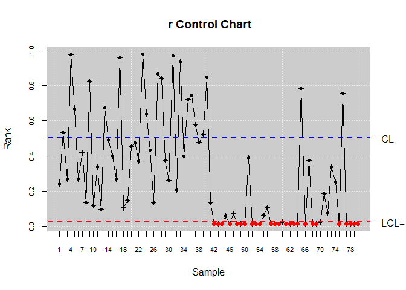

<!-- README.md is generated from README.Rmd. Please edit that file -->

# Descripcion general

<!-- badges: start -->
<!-- badges: end -->

El paquete qcr en R tiene como propósito principal ofrecer herramientas
para crear y analizar gráficos de control de calidad. Está orientado a
simplificar el seguimiento y control de procesos dentro del ámbito del
Control Estadístico de Calidad (SPC, por su nombre en inglés), ayudando
a los usuarios a determinar si un proceso opera bajo control estadístico
y a identificar posibles fuentes de variabilidad que puedan influir en
su rendimiento.

## Instalación

You can install the development version of r6qcr from
[GitHub](https://github.com/) with:

``` r
# install.packages("pak")
pak::pak("Bryanjat/r6qcr")
```

``` r
library(r6qcr)
```

## Ejemplos

``` r
## librerias
suppressWarnings(suppressMessages(library(qcr)))
```

El paquete qcr en R está diseñado para proporcionar herramientas que
permitan la creación y el análisis de gráficos de control, los cuales
son fundamentales para monitorear y controlar procesos dentro del marco
del Control Estadístico de Calidad (SPC, por sus siglas en inglés).
Estos gráficos ayudan a los usuarios a evaluar si un proceso se
encuentra bajo control estadístico y a identificar posibles fuentes de
variabilidad que puedan afectar su desempeño.

### fdqcd (Functional data quality control)

Los datos funcionales son observaciones que se registran como funciones
continuas en un dominio, como tiempo, espacio o frecuencia.

``` r
m <- 30
tt<-seq(0,1,len=m) # Crea un vector de 0 1 partido en 30
mu<-30 * tt * (1 - tt)^(3/2) 
n0 <- 100
set.seed(12345) # Semilla
mdata<-matrix(NA,ncol=m,nrow=n0) # Crea una matriz de NA  de nxm
sigma <- exp(-3*as.matrix(dist(tt))/0.9)
for (i in 1:n0) mdata[i,]<- mu+0.5*mvrnorm(mu = mu,Sigma = sigma )
fdchart <- fdqcd(mdata)
plot(fdchart,type="l",col="red")
```



### npqcs.r

El gráfico R es un tipo de gráfico de control que se utiliza en el
Control Estadístico de Calidad para monitorear la variabilidad dentro de
los subgrupos de un proceso. Evalúa si la dispersión (rango) de los
datos en cada subgrupo está bajo control estadístico.

``` r
set.seed(356)
mu<-c(0,0)
Sigma<- matrix(c(1,0,0,1),nrow = 2,ncol = 2)
u <- c(2,2)
S <- matrix(c(4,0,0,4),nrow = 2,ncol = 2)
G <- rmvnorm(540, mean = mu, sigma = Sigma)
x<- rmvnorm(40,mean=u,sigma = S)
x <- rbind(G[501:540,],x)
M <- G[1:500,]
data.npqcd <- npqcd(x,M)
str(data.npqcd)
#> List of 2
#>  $ x: num [1:80, 1:2, 1] 0.995 -1.274 -1.174 -0.347 0.931 ...
#>  $ G: num [1:500, 1:2] 0.306 -0.322 1.389 1.438 -0.784 ...
#>  - attr(*, "data.name")= chr "DATA"
#>  - attr(*, "type.data")= chr "Multivariate"
#>  - attr(*, "class")= chr [1:2] "npqcd" "list"
res.npqcs <- npqcs.r(data.npqcd,method = "Liu", alpha=0.025)
str(res.npqcs)
#> List of 9
#>  $ npqcd     :List of 2
#>   ..$ x: num [1:80, 1:2, 1] 0.995 -1.274 -1.174 -0.347 0.931 ...
#>   ..$ G: num [1:500, 1:2] 0.306 -0.322 1.389 1.438 -0.784 ...
#>   ..- attr(*, "data.name")= chr "DATA"
#>   ..- attr(*, "type.data")= chr "Multivariate"
#>   ..- attr(*, "class")= chr [1:2] "npqcd" "list"
#>  $ type      : chr "r"
#>  $ depth.data: num [1:80, 1] 0.0243 0.0866 0.0292 0.2412 0.1214 ...
#>  $ statistics: num [1:80, 1] 0.242 0.532 0.268 0.974 0.666 0.268 0.42 0.136 0.824 0.118 ...
#>  $ alpha     : num 0.025
#>  $ limits    : Named num [1:2] 0.025 0.5
#>   ..- attr(*, "names")= chr [1:2] "lcl" "cl"
#>  $ data.name : chr "DATA"
#>  $ method    : chr "Liu"
#>  $ violations: int [1:25] 42 43 44 46 48 49 50 52 53 54 ...
#>  - attr(*, "class")= chr [1:2] "npqcs.r" "npqcs"
summary(res.npqcs)
#> 
#> Summary of group statistics:
#>        V1        
#>  Min.   :0.0140  
#>  1st Qu.:0.0140  
#>  Median :0.1970  
#>  Mean   :0.3018  
#>  3rd Qu.:0.4810  
#>  Max.   :0.9760  
#> 
#> Number of quality characteristics:  2
#> Number of samples or observations:  80
#> Number of observations or sample size:  1
#> Control limits: 
#>   lcl    cl 
#> 0.025 0.500 
#> 
#> Beyond limits of control: 
#>  [1] 0.014 0.014 0.014 0.014 0.014 0.014 0.014 0.014 0.014 0.014 0.014 0.014
#> [13] 0.014 0.014 0.014 0.014 0.016 0.014 0.014 0.014 0.014 0.014 0.014 0.014
#> [25] 0.014
plot(res.npqcs,title =" r Control Chart")
```


