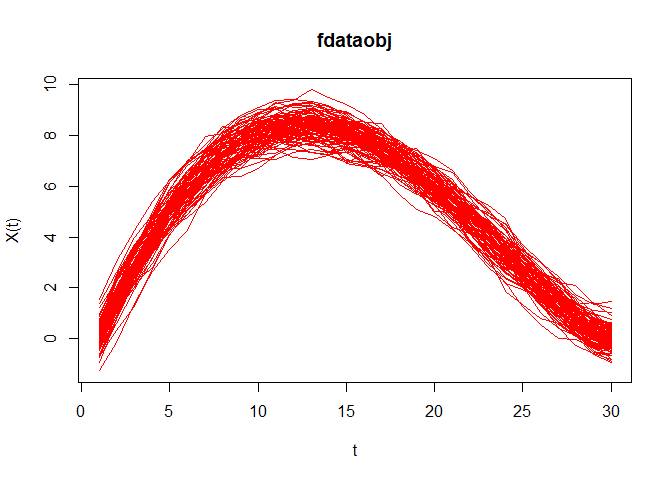

<!-- README.md is generated from README.Rmd. Please edit that file -->

# r6qcr

<!-- badges: start -->
<!-- badges: end -->

La meta de r6qcr es poder realizar una clase madre con otros paquetes

## Installation

You can install the development version of r6qcr from
[GitHub](https://github.com/) with:

``` r
# install.packages("pak")
pak::pak("Bryanjat/r6qcr")
```

## Example

``` r
## librerias
library(qcr)
#> Warning: package 'qcr' was built under R version 4.3.3
#> Loading required package: qcc
#> Warning: package 'qcc' was built under R version 4.3.3
#> Package 'qcc' version 2.7
#> Type 'citation("qcc")' for citing this R package in publications.
#> Loading required package: fda.usc
#> Loading required package: fda
#> Warning: package 'fda' was built under R version 4.3.3
#> Loading required package: splines
#> Loading required package: fds
#> Warning: package 'fds' was built under R version 4.3.3
#> Loading required package: rainbow
#> Warning: package 'rainbow' was built under R version 4.3.3
#> Loading required package: MASS
#> Loading required package: pcaPP
#> Warning: package 'pcaPP' was built under R version 4.3.3
#> Loading required package: RCurl
#> Warning: package 'RCurl' was built under R version 4.3.3
#> Loading required package: deSolve
#> Warning: package 'deSolve' was built under R version 4.3.3
#> 
#> Attaching package: 'fda'
#> The following object is masked from 'package:graphics':
#> 
#>     matplot
#> Loading required package: mgcv
#> Loading required package: nlme
#> Warning: package 'nlme' was built under R version 4.3.3
#> This is mgcv 1.9-0. For overview type 'help("mgcv-package")'.
#> Loading required package: knitr
#> Warning: package 'knitr' was built under R version 4.4.0
#>  fda.usc is running sequentially usign foreach package
#>  Please, execute ops.fda.usc() once to run in local parallel mode
#>  Deprecated functions: min.basis, min.np, anova.hetero, anova.onefactor, anova.RPm
#>  New functions: optim.basis, optim.np, fanova.hetero, fanova.onefactor, fanova.RPm
#> ----------------------------------------------------------------------------------
#> Loading required package: mvtnorm
#> Warning: package 'mvtnorm' was built under R version 4.4.0
#> 
#>  Package qcr: Quality Control Review 
#>  version 1.4 (built on 2022-02-15).
#>  Copyright Miguel A. Flores Sanchez 2016-2022.
```

### fdqcd (Functional data quality control)

``` r
m <- 30
tt<-seq(0,1,len=m) # Crea un vector de 0 1 partido en 30
mu<-30 * tt * (1 - tt)^(3/2) 
n0 <- 100
set.seed(12345) # Semilla
mdata<-matrix(NA,ncol=m,nrow=n0) # Crea una matriz de NA  de nxm
sigma <- exp(-3*as.matrix(dist(tt))/0.9)
for (i in 1:n0) mdata[i,]<- mu+0.5*mvrnorm(mu = mu,Sigma = sigma )
fdchart <- fdqcd(mdata)
plot(fdchart,type="l",col="red")
```


### npqcs.r

This function is used to compute statistics required by the r chart.

``` r
set.seed(356)
mu<-c(0,0)
Sigma<- matrix(c(1,0,0,1),nrow = 2,ncol = 2)
u <- c(2,2)
S <- matrix(c(4,0,0,4),nrow = 2,ncol = 2)
G <- rmvnorm(540, mean = mu, sigma = Sigma)
x<- rmvnorm(40,mean=u,sigma = S)
x <- rbind(G[501:540,],x)
M <- G[1:500,]
data.npqcd <- npqcd(x,M)
str(data.npqcd)
#> List of 2
#>  $ x: num [1:80, 1:2, 1] 0.995 -1.274 -1.174 -0.347 0.931 ...
#>  $ G: num [1:500, 1:2] 0.306 -0.322 1.389 1.438 -0.784 ...
#>  - attr(*, "data.name")= chr "DATA"
#>  - attr(*, "type.data")= chr "Multivariate"
#>  - attr(*, "class")= chr [1:2] "npqcd" "list"
res.npqcs <- npqcs.r(data.npqcd,method = "Liu", alpha=0.025)
str(res.npqcs)
#> List of 9
#>  $ npqcd     :List of 2
#>   ..$ x: num [1:80, 1:2, 1] 0.995 -1.274 -1.174 -0.347 0.931 ...
#>   ..$ G: num [1:500, 1:2] 0.306 -0.322 1.389 1.438 -0.784 ...
#>   ..- attr(*, "data.name")= chr "DATA"
#>   ..- attr(*, "type.data")= chr "Multivariate"
#>   ..- attr(*, "class")= chr [1:2] "npqcd" "list"
#>  $ type      : chr "r"
#>  $ depth.data: num [1:80, 1] 0.0243 0.0866 0.0292 0.2412 0.1214 ...
#>  $ statistics: num [1:80, 1] 0.242 0.532 0.268 0.974 0.666 0.268 0.42 0.136 0.824 0.118 ...
#>  $ alpha     : num 0.025
#>  $ limits    : Named num [1:2] 0.025 0.5
#>   ..- attr(*, "names")= chr [1:2] "lcl" "cl"
#>  $ data.name : chr "DATA"
#>  $ method    : chr "Liu"
#>  $ violations: int [1:25] 42 43 44 46 48 49 50 52 53 54 ...
#>  - attr(*, "class")= chr [1:2] "npqcs.r" "npqcs"
summary(res.npqcs)
#> 
#> Summary of group statistics:
#>        V1        
#>  Min.   :0.0140  
#>  1st Qu.:0.0140  
#>  Median :0.1970  
#>  Mean   :0.3018  
#>  3rd Qu.:0.4810  
#>  Max.   :0.9760  
#> 
#> Number of quality characteristics:  2
#> Number of samples or observations:  80
#> Number of observations or sample size:  1
#> Control limits: 
#>   lcl    cl 
#> 0.025 0.500 
#> 
#> Beyond limits of control: 
#>  [1] 0.014 0.014 0.014 0.014 0.014 0.014 0.014 0.014 0.014 0.014 0.014 0.014
#> [13] 0.014 0.014 0.014 0.014 0.016 0.014 0.014 0.014 0.014 0.014 0.014 0.014
#> [25] 0.014
plot(res.npqcs,title =" r Control Chart")
```


